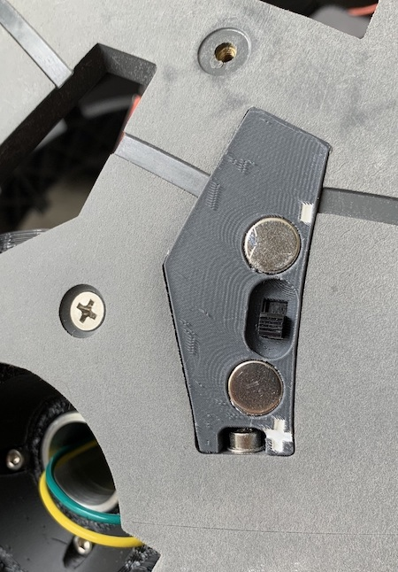
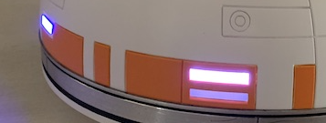
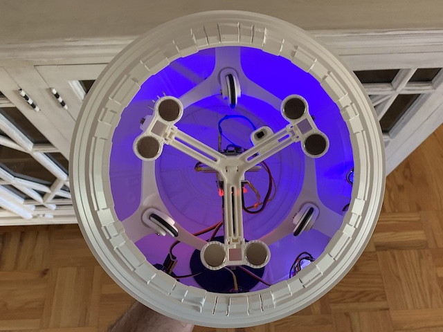
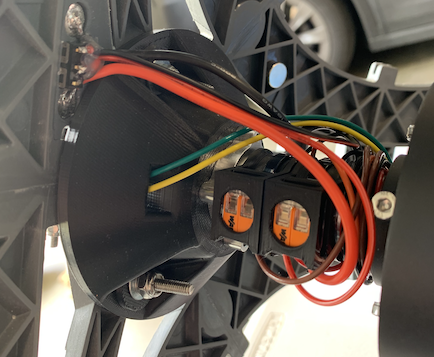
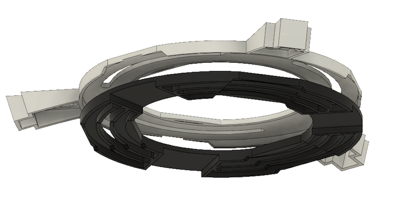

# A collection of BB8 mods

Things I've done to my BB8 along the way.

## Chargeport and Power Switch

The relay I used can be found on Amazon, but I have seen comparable models elsewhere.

https://www.amazon.com/gp/product/B07L6Y7LVW/ref=ppx_yo_dt_b_search_asin_title?ie=UTF8&psc=1

[Charge port power switch](stls/charge_port_micro_switch.stl) - Replaced the wireless relay with a solid state one.

## Dome Lenses

New lenses for addressable LEDs, intended to remove the hot spots.

[Lens for front logics, print 2 of these](stls/dome_front_logics.stl)

[Lens for back logics](stls/dome_back_logics.stl)

## Halo Eletronics Mount

Lowers the center of gravity for the battery, provides a mount for the dome's electronics and a switch.  The switch is easily accessible and the dome can be plugged in to charge while on the droid.

[Halo Brace](stls/halo_brace.stl)

[Halo Battery Mount](stls/halo_battery_mount.stl)

[Halo Switch Mount](stls/halo_switch_mount.stl)

## New Lens for Panel 2

[P2 Square Lens STL](stls/p2_square_lens.stl) - A neopixel lens used with Cary's thin panels, this fits in panel 2's square cutout.

## Wireless firmware uploads and control!!!!

One, if not my favorite mods.

[Wireless Firmware Upload and Editing](firmware_upload.md) - With a few simple modifications you can upload new firmware and edit your drive settings no disassembly required.

## WAGO Connector Mount

[WAGO Axle Mount STL](stls/wago_axle_mounts.stl) - Easily secure WAGO connectors to your axle using a zip tie.  Can support 4 WAGO connectors per axle.

## Things I've passed up...

Mount for induction power coils.  These slide into the Halo setup easily.  I decided to not go this route because of the enefiecient power transfer.  The transmitter coils tolerance for out of spec voltage was bad.  I fried my first.  After regulating it, then looking at the power recived on the other end, it about a 50% power loss.  That coupled with the expensive slip ring and parts, I decided to abandon my effort.  But it's here if you like.

https://www.amazon.com/gp/product/B076H1J7V1/ref=ppx_yo_dt_b_search_asin_title?ie=UTF8&psc=1

[Halo Receiver Mount](stls/halo_receiver_mount.stl) - The receiving mount which attaches the magnet mounts.

[Halo Transmitter Mount](stls/halo_transmitter_mount.stl) - The transmitter mount which attaches the mount inside the body.
