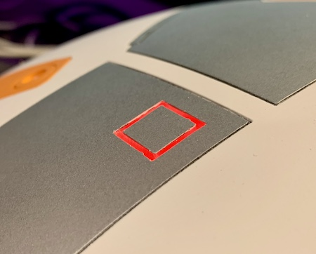

# A collection of BB8 mods

Things I've done to my BB8 along the way.

[Charge port power switch](stls/charge_port_micro_switch.stl) - Replaced the wireless relay with a solid state one.

[P2 Square Lens STL](stls/p2_square_lens.stl) - A neopixel lens for panel 2's square cutout.

[Wireless Firmware Upload and Editing](firmware_upload.md) - With a few simple modifications you can upload new firmware and edit your drive settings no disassembly required.

[WAGO Axle Mount STL](stls/wago_axle_mounts.stl) - Easily secure WAGO connectors to your axle using a zip tie.  Can support 4 WAGO connectors per axle.