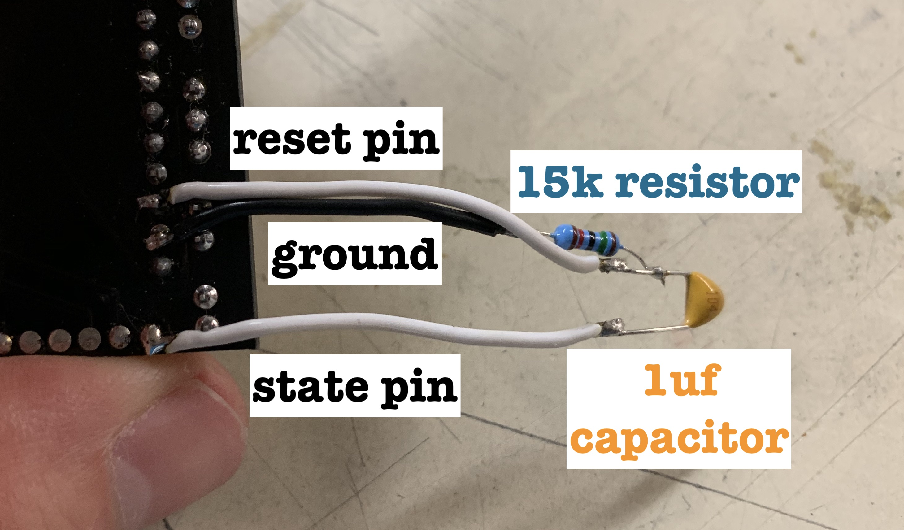
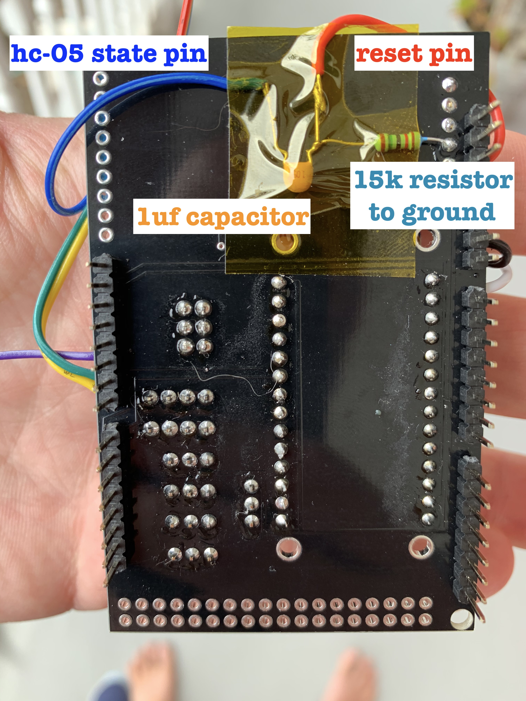
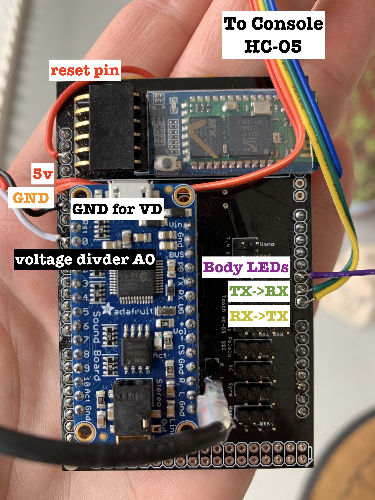

# Wireless flashing and drive editing

There are several settings that are required for wireless firmware flashing to work along with some minor modifications to the hardware.  

The `AT+POLAR` command tells the HC-05 module to use the status LED at it default setting but changes the behavior on the state pin, instead of going high when a serial connection is opened the pin will go low.  Essentially the state pin emulates the DTR pin functionality used with FTDI chips on Arduinos.

Once the software side is configured, you will need a small hardware mod to help emulate the DTR pin/reset switch.


### Software Mods

#### Configuration changes to the modules

Start by changing the settings on your dome's HC-05 module while in `AT Mode`.

```bash
AT+POLAR=1,0
AT+UART=115200,0,0
```

You will need to apply change the baud rate on the HC-05 master used in body to communicate with the dome.

```bash
AT+UART=115200,0,0
```

*I went an extra step further here and made sure that the only address the master module was allowed to bind to was the dome.  You can get the dome HC-05 module's address by running the command `AT+ADDR?` while in `AT` mode.  Then on the master HC-05 run 'AT+BIND=98d3,35,710c09` (but replace 98d3,35,710c09 with your dome's HC-05 module).*

The drive and dome firmware will then need to be updated to use this new baud rate.  The default is current 57600, but the boot loader on new Arduino Nanos expects upgrades at 1152000.

#### Configuring the Drive Console

Now choose a name for console access to your BB unit.  I chose **BB8 Drive Console**.  Remember this name and the pass code you pick, you need to connect this port for changing drive settings and flashing firmware.

**NOTE: Do not use the same passcode that you used for your dome and body HC-05s.**

```
AT+NAME=XXXXXXXX
AT+PSWD=XXXX
AT+ROLE=0
AT+CMODE=1
AT+ROLE=0
AT+POLAR=1,0
AT+UART=115200,0,0
AT+RESET
```

No firmware updates are necessary to enable wireless flashing and drive editing, the drive's Serial0 already runs at the required 115200 bps.

### Hardware Mods

Once configured, make the following circuit.  Technically you can get away with just the 1uf capacitor.  In my case it sometimes failed to reset on when running from arduino's voltage regulator.  Adding the 15k resistor brings the voltage to the reset pin closer to 3v. There is a 10k resistor on the other side of the reset pin, so you are making a voltage divider here . (On my dome, I used an external power supply at 5.2v, without the resistor the voltage never dropped long enough to trigger a reset.)

#### Dome PCB Modifications

Here we are connecting the state pin on the dome's HC-05 module to the reset pin on the dome's PCB with a capacitor in between to *bounce* the voltage drop and trigger a reset on an upload attempt.  Note that the facing the reset pin has a 15k resistor going to ground.



#### Body (HC-05 Drive Console modifiactions)

I used a ribbon cable created a 5 pin header to connect my drive's HC-05 serial console to the main PCB.  Using a ribbon cable I was able to route my HC-05 module away and secure it to the drive.

Starting from the back side.  Build the same circuit we did for the dome's PCB.  Once again, you will be connecting the HC-05 module's state pin to the reset pin with a 1uf capacitor in between.  Also note again, the resistor goes from a ground pin to leg on the reset side of the capacitor.



Once the state pin is connected, flip the board over and make the next 4 connections.  5V, ground, TX, and RX.  You solder them inplace like I did or use a 4 pin header and plug it directly into the board (it's already labled HC-05 along with it's pin outs).  I just got carried away with the soldering iron. :P

*Ignore the voltage divider and body LEDs for now.*


